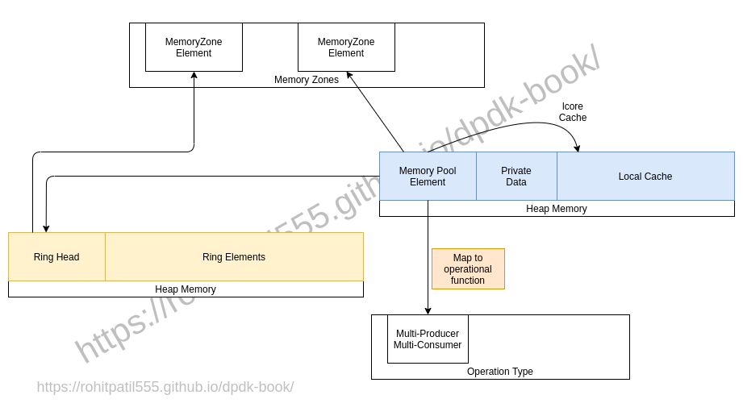

# Memory Pool

In this section we will look at how DPDK create memory pool and see the API use to create pool.
We will look into detail about catch part in later section.

There is thumb rule for memory performance _"pre-allocate buffer and use them at run time"_
DPDK use the same method to get max perfromance out of CPU.

## Introduction

DPDK store information of each memory allocation as zone area. And link with them each other to handle free operation.
To manage buffer element, DPDK use ring data structure of variouse type as listed below:
* Single Producer and Single Consumer.
* Single Produce and Multi Consumer.
* Multi Producer and Single Consumer.
* Multi Producer and Multi Consumer.

To understand ring data structure please refer [DPDK document](https://doc.dpdk.org/guides/prog_guide/ring_lib.html). It explain in more detail with diagram.

Below memory allocation view, help you to understand APIs and memory module used in DPDK.




## APIs

### Initialization

#### Pool Create

This create only mempool structure shown in above diagram. [Color Blue]

```
struct rte_mempool *
rte_mempool_create_empty(const char *name, unsigned n, unsigned elt_size,
        unsigned cache_size, unsigned private_data_size,
        int socket_id, unsigned flags)
```

For knowing more detail about each field refer to [API document](https://doc.dpdk.org/api/rte__mempool_8h.html).

#### Associate with operation

Associate this with memory pool operation shown in above diagram [Color Red]

```
int rte_mempool_set_ops_byname	(	struct rte_mempool * 	mp,
                                  const char * 	name,
                                  void * 	pool_config
                                )
```

#### Allocate Memory Pool

This API create Ring structure and associate with memory pool. [Color Yellow]
And this memory is actually get use when we use buffer from this Pool.

```
int 	rte_mempool_populate_default (struct rte_mempool *mp)
```

### Runtime

#### Get From Pool

To get buffer from memory pool use below API
```
// In bulk
static __rte_always_inline int 	rte_mempool_get_bulk (struct rte_mempool *mp, void **obj_table, unsigned int n)

// Single
static __rte_always_inline int 	rte_mempool_get (struct rte_mempool *mp, void **obj_p)
```

#### Return to Pool

To return buffer to memory pool use below API
```
// In bulk
static __rte_always_inline void 	rte_mempool_put_bulk (struct rte_mempool *mp, void *const *obj_table, unsigned int n)

// Single
static __rte_always_inline void 	rte_mempool_put (struct rte_mempool *mp, void *obj)
```
