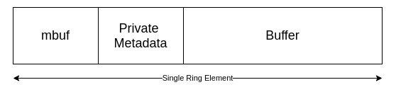

# Packet Buffer

This generate packet buffer pool that manage packet storage. And also some APIs to manipulate packet.
We will go though only few required API through this section for remaining please refer to DPDK API guide.

## Introduction

Whenever we create packet buffer pool it allocate memory in same structure as described or shown in
[memory pool](mempool.md) section. But here we have to call only one API. You consider it as a
wrapper function.

For packet buffer, every block or element of ring array/queue is partition as shown below:



Mbuf is structure use in DPDK to manage packet. It is just similar to SKB but with different metadata.
To understand Mbuf arround APIs, e.g. to get packet start point use api rte_pktmbuf_mtop().

Please refer to first section of [DPDK document](https://doc.dpdk.org/guides/prog_guide/mbuf_lib.html).
To understand other sections, my suggession is try out example. We will take look at some of them in our
final tutorial.

## APIs

### Initialization

#### Pool Create

This API is use to create pool and use buffer from this pool to store packet meta and packet payload.

```
struct rte_mempool* rte_pktmbuf_pool_create	(	const char * 	name,
                                              unsigned 	n,
                                              unsigned 	cache_size,
                                              uint16_t 	priv_size,
                                              uint16_t 	data_room_size,
                                              int 	socket_id
                                            )
```
